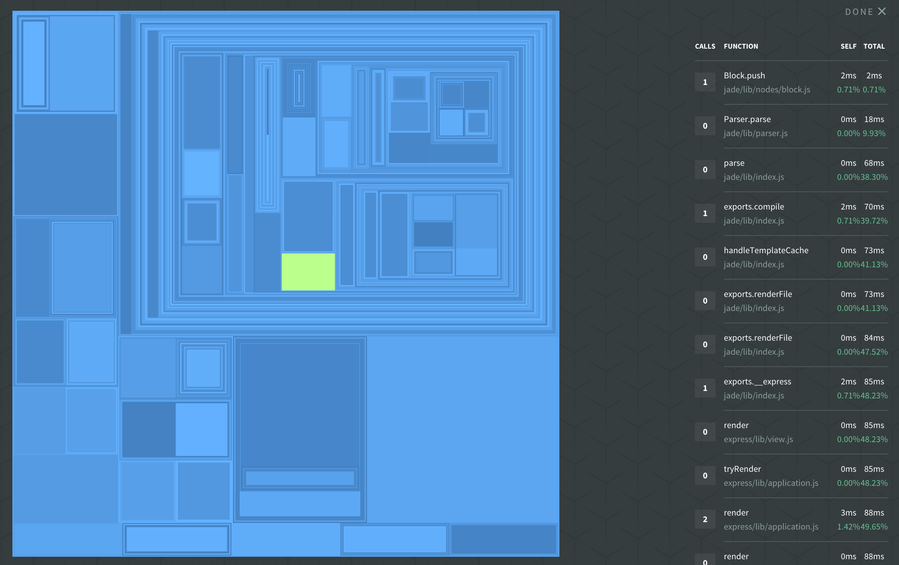

background-image: url(images/Node-Interactive-template-2.png)

//!embed: toolbar.md

--------------------------------------------------------------------------------

# introduction to profiling Node.js applications

Patrick Mueller
[`@pmuellr`](https://twitter.com/pmuellr),
[`muellerware.org`](http://muellerware.org) 
senior node engineer at [NodeSource](https://nodesource.com) 

<a href="http://pmuellr.github.io/slides/2015/12-profiling-node-intro">
         http://pmuellr.github.io/slides/2015/12-profiling-node-intro
</a>
 
<a href="http://pmuellr.github.io/slides/2015/12-profiling-node-intro/slides.pdf">
         http://pmuellr.github.io/slides/2015/12-profiling-node-intro/slides.pdf
</a>
 
<a href="http://pmuellr.github.io/slides/">
         http://pmuellr.github.io/slides/
</a>
(all of Patrick's slides)

//!embed: toolbar.md

//!embed: layout.md
================================================================================

## what kind of profiling?

* **<u>performance</u>** with V8's CPU profiler

* **<u>memory</u>** with V8's heap snapshots

//!embed: layout.md
================================================================================

class: center, middle

# profiling performance

//!embed: layout.md profiling performance
================================================================================

## what does V8's CPU profiler do?

* turn profiler on / off

* when on, at regular intervals, V8 will capture current stack trace, with
  time stamp, and source file / line numbers

* when turned off, profiler will aggregate the information, and produce a JSON
  data structure for analysis tools

--------------------------------------------------------------------------------

## time-line showing stack traces

--------------------------------------------------------------------------------

## table showing functions time

--------------------------------------------------------------------------------

## flame graph

--------------------------------------------------------------------------------

## sunburst

--------------------------------------------------------------------------------

## treemap

--------------------------------------------------------------------------------

## understanding CPU profiling

* intro: [Google Developers: Speed Up JavaScript Execution](https://developers.google.com/web/tools/chrome-devtools/profile/rendering-tools/js-execution?hl=en)

* **self time** - the time it took to run the function, **not** including any functions that it called
* **total time** - the time it took to run the function, including any functions that it called

--------------------------------------------------------------------------------

## how can you get CPU profiles?

* [npm v8-profiler](https://www.npmjs.com/package/v8-profiler) (requires
  instrumenting your code)

* [npm node-inspector](https://www.npmjs.com/package/node-inspector)

* [StrongLoop arc](https://strongloop.com/node-js/devops-tools/)

* [NodeSource N|Solid](https://nodesource.com/products/nsolid)

--------------------------------------------------------------------------------

## demo time!

* using N|Solid - [getting started info](https://nodesource.com/blog/getting-started-with-the-nsolid-console)

* see the instructions in [demos/README.md](demos/README.md)

* [source for the express-demo](demos/express-demo.js.html)

//!embed: layout.md
================================================================================

class: center, middle

# profiling memory

//!embed: layout.md profiling memory
================================================================================

## what are V8 heap snapshots?

* blah blah

--------------------------------------------------------------------------------

## what kind of output can you get?

* blah blah

--------------------------------------------------------------------------------

## how can you get heap snapshots?

* blah blah

--------------------------------------------------------------------------------

## demo time!

see the instructions in [demos/README.md](demos/README.md)

[source for the express-demo](demos/express-demo.js.html)

//!embed: layout.md
================================================================================

class: center, middle

# profiling tips

//!embed: layout.md profiling tips
================================================================================

## profiling performance

* blah blah

--------------------------------------------------------------------------------

## profiling memory

* blah blah

//!embed: layout.md
================================================================================

class: center, middle

# `fin`

--------------------------------------------------------------------------------

background-image: url(images/Node-Interactive-template-1.png)
