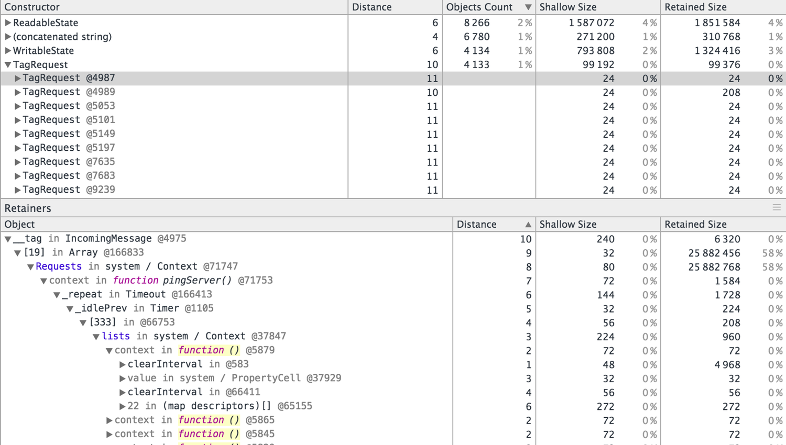

background-image: url(images/Node-Interactive-template-2.png)

//!embed: toolbar.md

--------------------------------------------------------------------------------

# introduction to profiling Node.js applications

Patrick Mueller
[`@pmuellr`](https://twitter.com/pmuellr),
[`muellerware.org`](http://muellerware.org) 
senior node engineer at [NodeSource](https://nodesource.com) 

<a href="http://pmuellr.github.io/slides/2015/12-profiling-node-intro">
         http://pmuellr.github.io/slides/2015/12-profiling-node-intro
</a>
 
<a href="http://pmuellr.github.io/slides/2015/12-profiling-node-intro/slides.pdf">
         http://pmuellr.github.io/slides/2015/12-profiling-node-intro/slides.pdf
</a>
 
<a href="http://pmuellr.github.io/slides/">
         http://pmuellr.github.io/slides/
</a>
(all of Patrick's slides)

//!embed: toolbar.md

//!embed: layout.md
================================================================================

## what kind of profiling?

* **<u>performance</u>** with V8's CPU profiler

* **<u>memory</u>** with V8's heap snapshots

//!embed: layout.md
================================================================================

class: center, middle

# profiling performance

//!embed: layout.md profiling performance
================================================================================

## what does V8's CPU profiler do?

* trigger profiler on / off

* when on, at regular intervals, V8 will capture current stack trace, with
  time stamp, and source file / line numbers

* when turned off, profiler will aggregate the information, and produce a JSON
  data structure for analysis tools

--------------------------------------------------------------------------------

## understanding CPU profiling

* intro: [Google Developers: Speed Up JavaScript Execution](https://developers.google.com/web/tools/chrome-devtools/profile/rendering-tools/js-execution?hl=en)

* provides times spent executing functions:

  * **self time** - the time it took to run the function, **not** including any functions that it called

  * **total time** - the time it took to run the function, including any functions that it called

--------------------------------------------------------------------------------

**time-line from Chrome Dev Tools**

--------------------------------------------------------------------------------

**table from Chrome Dev Tools**

--------------------------------------------------------------------------------

**flame graph from N|Solid**

--------------------------------------------------------------------------------

**sunburst from N|Solid**

--------------------------------------------------------------------------------

## how can you get CPU profiles?

* [npm v8-profiler](https://www.npmjs.com/package/v8-profiler) (requires
  instrumenting your code)

* [npm node-inspector](https://www.npmjs.com/package/node-inspector)

* [StrongLoop arc](https://strongloop.com/node-js/devops-tools/)

* [NodeSource N|Solid](https://nodesource.com/products/nsolid)

--------------------------------------------------------------------------------

## demo time!

expecting faster response time in app when load testing with `ab` -
**what's slowing down this app?**

* [source for the express-demo](demos/express-demo.js.html)

* see the instructions in [demos/README.md](demos/README.md)

* using N|Solid - [getting started info](https://nodesource.com/blog/getting-started-with-the-nsolid-console)

//!embed: layout.md
================================================================================

class: center, middle

# profiling memory

//!embed: layout.md profiling memory
================================================================================

## what are V8 heap snapshots?

* JSON file describing every reachable JavaScript object in the application;
  taking a snapshot always starts with a garbage collection

* JSON files are ... large; figure 2x heap memory allocated by Node.js

* triggered via single native V8 call - `TakeHeapSnapshot()`

--------------------------------------------------------------------------------

## understanding heap snapshots

* intro: [Google Developers: Viewing Heap Snapshots](https://developers.google.com/web/tools/chrome-devtools/profile/memory-problems/heap-snapshots)

* object sizes/counts, grouped by constructor

  * **shallow size** - the size of memory held by an object itself

  * **retained size** - the size of memory that can be freed once an object is deleted

--------------------------------------------------------------------------------

**heapmap from Chrome Dev Tools**

--------------------------------------------------------------------------------

## what kind of output can you get?

* large JSON file - could be 100's of MB; figure 2x allocated heap

* can "diff" snapshots to help identify leaks

* can drill into or out from references in Chrome Dev Tools; references / referenced by

--------------------------------------------------------------------------------

## how can you get heap snapshots?

* [npm v8-profiler](https://www.npmjs.com/package/v8-profiler) (requires
  instrumenting your code)

* [npm node-inspector](https://www.npmjs.com/package/node-inspector)

* [StrongLoop arc](https://strongloop.com/node-js/devops-tools/)

* [NodeSource N|Solid](https://nodesource.com/products/nsolid)

--------------------------------------------------------------------------------

## demo time!

this app seems to be leaking memory - **what objects are leaking?**

* [source for the express-demo](demos/express-demo.js.html)

* see the instructions in [demos/README.md](demos/README.md)

* using N|Solid - [getting started info](https://nodesource.com/blog/getting-started-with-the-nsolid-console)

//!embed: layout.md
================================================================================

class: center, middle

# profiling tips

//!embed: layout.md profiling tips
================================================================================

## profiling performance

* look for **width** in trace visualizations; height only shows stack
  trace which may not have any perf consequences

* "script" profiling a web server: start profile, run load tester, stop profile

* use node/v8 option `--no-use-inlining` to turn off function inlining; stack
  traces may make more sense (but no inlining!)

--------------------------------------------------------------------------------

## profiling memory

* easiest way to find a memory leak:
  * take a heap snapshot; run load tester; take another heap snapshot;
    diff in Chrome Dev Tools

* 'tag' objects you think might be leaking w/easy to find class:

  `req.__tag = new TagRequest()`

//!embed: layout.md
================================================================================

class: center, middle

# `fin`

--------------------------------------------------------------------------------

background-image: url(images/Node-Interactive-template-1.png)
