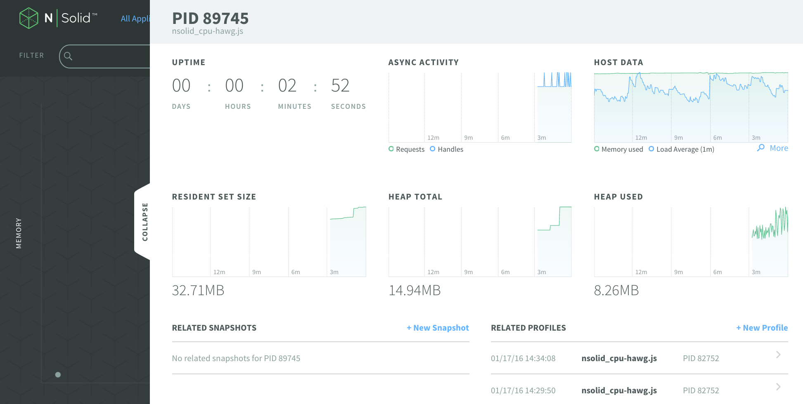

Getting Started with N|Solid Profiling
================================================================================

In a previous blog post,
"[Getting Started with the N|Solid Console][gsnsc]", I covered downloading and
installing N|Solid and the N|Solid Console.  Once you've got the console set
and running, you can perform extra profiling on your application: memory
profiling and CPU profiling.  This blog post will go into some more detail on
these profiling tools.

Also note that I recently held a webinar
["Introduction to Profiling Node.js Applications"][],
which covers these tools.

What is profiling?  Profiling a program generally means capturing statistics
about the program while it's running, and then providing some kind of useful
visualization of those statistics.  Those visualizations are intended to
provide a deeper view into your application performance, as well as help
spot problem areas in your application, like memory leaks or code bottlenecks.

The two profiling tools I'll be talking about today are V8's heap profiler and
CPU profiler.  Both of these tools are baked into N|Solid; there's no need to
add additional packages or instrument your code.  You can use the tools with
N|Solid instance you have access to.

[gsnsc]: https://nodesource.com/blog/getting-started-with-the-nsolid-console/

Memory Profiling with Heap Snapshots
--------------------------------------------------------------------------------

The heap profiler tool will generate a heap snapshot upon request.  The
heap snapshot is a JSON-able description of all the JavaScript objects allocated
in your application.  These descriptions are quite large - figure at least
twice the amount of RAM your application has allocated.  Eg, if you have an
application which has 100MB of space allocated for JavaScript objects, plan on
the heap snapshot being a JSON object of at least 200MB.

Once the heap snapshot is created, it's displayed in a visualization.  

The current state of the art for heap snapshot visualizations is to show a
tabular view of the objects, grouped by constructor name.  Also known as class
name. Statistics available are:

* number of instances of this class
* "shallow size" of all the instances
* "retained size" of all the instances

Shallow size is the size of the object, without any of the things that it
references, including properties.  Typically only Strings and Arrays have
interesting shallow size values.

To generate one of these heap snapshots,
find the application in the N|Solid Application view, and then click on the
application to display the Cluster view for that application.  Click on one
the instances - the dots in the graph - and then expand the panel to the right.
This will show some additional statistics of the process.  

Click the "New Shapshot" link, and a heap snapshot will be
generated and then displayed.  You can sort the classes by object count,
shallow size and retained size, and also filter the list by name.  Type
"Point" in the filter entry, and you'll see that a number of Point2D objects
are still live in your program.

That might be enough information to help track down your leak, but if you need
more information you can download the shapshot and then load it into Chrome
Dev Tools (CDT).  Click the "Download Snapshot" button.  This will download the
snapshot you're currently looking at.  You can then bring up CDT, select the
Profiles tab, click the "Load" button, and select the relevant ".heapsnapshot"
file.  This shows a view similar to N|Solid, but also allows you to see
references to your objects.  Make sure you're in the "Summary" view (next to
the Class filter at the top), then expand the Point2D objects.  Select one of
the Point2D instances, and in the Retainers pane below you'll see the references
to the instance.  You can see a reference to the object is held by an object
named `LeakyCache` - that's probably where you're going to want to look for your
leak.

Another thing you can do with CDT is compare two snapshots - a "before" and
"after" snapshot.  The Comparison view will show you the difference in object
counts between the two snapshots.  To create another shapshot, go back into
N|Solid and click "New Snapshot".  After the snapshot has been generated,
download it and load it into CDT again.  Select the second snapshot, and
change the view to the Comparison view.  You can then see all the Point2D
objects which have been created between the time the two snapshots were taken.

So that all works great if you're using classes in your program, but what if
you are leaking arrays or objects?  They'll get lumped into all the other
objects and arrays in the snapshot, and it will be impossible to distinguish
which objects they really are.

For example, maybe your program uses a literal object form of points, instead
of a Point class.  When you profile this application, all the points objects
are going to be lumped into Object, so you're not going to know which objects
are actually in there.

To help diagnose a situation like this, you can add a named class instance "tag"
to the objects you're curious about.  All this will do is add a new property
to your object, but now you'll be able to see the counts of those objects.  

When you generate and view a snapshot now, there will be a `TagPoint2D` entry,
which shows the number of Point2D objects that you've created.  You can also
follow the references to these objects in CDT to find the objects which are
still referencing these objects.

CPU Profiling with Profiles
--------------------------------------------------------------------------------

Now let's look at the other profiling tool, the CPU profiler.

The CPU profiler will capture stack traces while it's running - you would
typically start the CPU profile at some point, let your program run for a
few seconds, and then stop the profiler to see the results.  The resulting
CPU profile is a listing of the stack traces running, while the profiler is
running, at sub-millisecond intervals.  This can be used to display a "flame
chart", which is all the stack frames laid out in a time chart.  Usually of
more interest are aggregated views like a "flame graph", which shows all the
stack frames aggregated into a single graph.

So, let's see how we can create a CPU profile and display it in a
cpu profile visualization.

If you're using N|Solid, again, all you're going to need to do is click on a button
to generate and display the CPU profile.  Otherwise you can use
the `v8-profiler` package to do this.  Follow the previous instructions
to add v8-profiler to your application, this time adding a trigger to start and
stop the profiler.

For this demo, we'll run a program named `cpu-hawg`, which is taking longer to
run that it should.  We'll see if the CPU profile tells us anything.

Find the application in the N|Solid Application view, and then click on the
application to display the Cluster view for that application.  You'll see
the dot which represents the single instance seems to be moving right and
left - the x-axis of this graph indicates CPU usage, so this program seems
to be running a bit hot at some points.
Click on the instance, and then expand the panel to the right.
Click the "New Profile" link, leave Profile Duration set for 5 seconds, and
select the "Flame Graph" visualization.  Click the "Start Profile" button, and
the CPU profiler will start.  After 5 seconds, the profiler will stop and the
visualization will be displayed.

You can hover over the rectangles in the visualization to see what function
they represent.  The x-axis represents the time the function took, and y-axis
is used to show what functions the function below them called.  Click
on the highest (non-thin) rectangle, and you'll see the full stack frame
including file location, on the right-hand side.  You can see that
`doStuff()` calls f() which calls e() and so on.  While you are hovering
over a rectangle, all the other instances of that function in the stack traces
is highlighted.  Hovering over doStuff() again, you can see that it appears to
be taking almost all the time in the program, based on the amount of width
it's taking up.  doStuff() is pretty clearly the most expensive function in
your program.

You can also display the CPU profile with a Sunburst and Treemap visualization.
The Sunburst visualization is like the FrameGraph, except the x-axis is wrapped
in a circle instead of a line, which tends to exaggerate time spent in functions
higher in a stack frame.  The Treemap represents time spent as the area of the
rectangles, with the function stack represented by enclosing rectangles.

"How to Record Heap Snapshots"
[goog-heap]: https://developers.google.com/web/tools/chrome-devtools/profile/memory-problems/heap-snapshots

"Speed Up JavaScript Execution"
[goog-cpu]: https://developers.google.com/web/tools/chrome-devtools/profile/rendering-tools/js-execution
