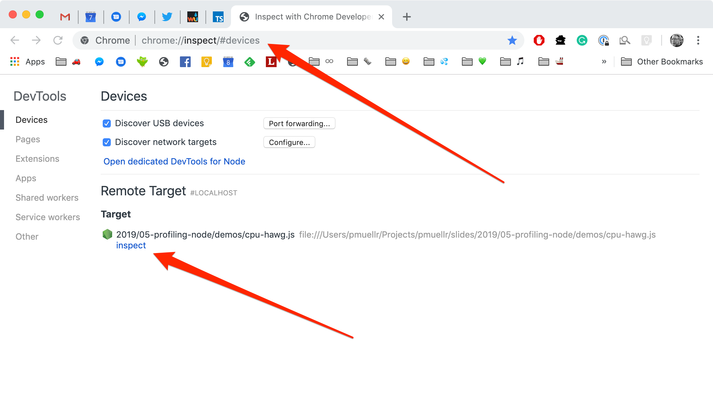
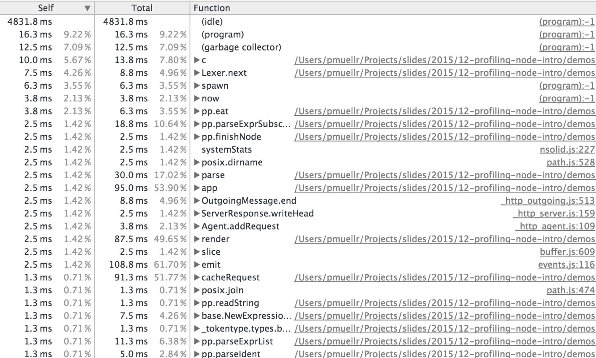
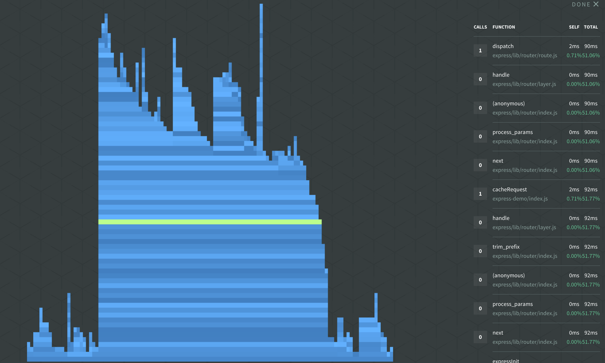

# profiling Node.js applications

Patrick Mueller
[`@pmuellr`](https://twitter.com/pmuellr),
[`muellerware.org`](http://muellerware.org) 
principal software engineer at [Elastic](https://elastic.co) 

<a href="http://pmuellr.github.io/slides/2019/05-profiling-node">
         http://pmuellr.github.io/slides/2019/05-profiling-node
</a>
 
<a href="http://pmuellr.github.io/slides/2019/05-profiling-node/slides.pdf">
         http://pmuellr.github.io/slides/2019/05-profiling-node/slides.pdf
</a>
 
<a href="http://pmuellr.github.io/slides/">
         http://pmuellr.github.io/slides/
</a>
(all of Patrick's slides)

//!embed: toolbar.md

//!embed: layout.md
================================================================================

## what is profiling?

* gaining insight into what your code is doing

* typically involving finding out:

  * why your code is so slow!

  * what are you doing with all that memory!

--------------------------------------------------------------------------------

## why should you profile your code?

* save money

  * run with less RAM
  * run with less CPU

* delight customers

  * your app runs faster

--------------------------------------------------------------------------------

## what kind of profiling for Node.js?

* **<u>performance</u>** with V8's CPU profiler

* **<u>memory</u>** with V8's heap snapshots

--------------------------------------------------------------------------------

## using the tools

* start your app with the Node.js `--inspect` option
* open URL `chrome://inspect/` in Chrome
* click the **inspect** link under **Remote Target**

--------------------------------------------------------------------------------

//!embed: layout.md
================================================================================

class: center, middle

# profiling performance

//!embed: layout.md profiling performance
================================================================================

## what does V8's CPU profiler do?

* **start profiler**: at regular intervals, V8 will capture current stack trace, with
  time stamp, and source file / line numbers

* **stop profiler**: profiler will aggregate the stack trace information,
  and produce a JSON data structure for analysis tools

--------------------------------------------------------------------------------

## understanding CPU profiling

* intro: [Google Developers: Speed Up JavaScript Execution](https://developers.google.com/web/tools/chrome-devtools/profile/rendering-tools/js-execution?hl=en)

* provides times spent executing functions:

  * **<u>self time</u>** - time to run the function, **not** including any functions that it called

  * **<u>total time</u>** - time to run the function, including any functions that it called

--------------------------------------------------------------------------------

**time-line from Chrome Dev Tools**

--------------------------------------------------------------------------------

**table from Chrome Dev Tools**

--------------------------------------------------------------------------------

**flame graph from N|Solid**

--------------------------------------------------------------------------------

**sunburst from N|Solid**

//!embed: layout.md
================================================================================

class: center, middle

# profiling memory

//!embed: layout.md profiling memory
================================================================================

## what are V8 heap snapshots?

* JSON file describing every reachable JavaScript object in the application;
  taking a snapshot always starts with a garbage collection

* JSON files are ... large; figure 2x heap memory allocated by Node.js

--------------------------------------------------------------------------------

## understanding heap snapshots

* intro: [Google Developers: Viewing Heap Snapshots](https://developers.google.com/web/tools/chrome-devtools/profile/memory-problems/heap-snapshots)

* object sizes/counts, grouped by constructor

  * **<u>shallow size</u>** - the size of memory held by an object itself

  * **<u>retained size</u>** - the size of memory that can be freed once an object is deleted

--------------------------------------------------------------------------------

**heapmap from Chrome Dev Tools**

--------------------------------------------------------------------------------

## what kind of output can you get?

* large JSON file - could be 100's of MB; figure 2x allocated heap

* can "diff" snapshots to help identify leaks

* can drill into or out from references in Chrome Dev Tools; references / referenced by

//!embed: layout.md
================================================================================

class: center, middle

# using the tools

--------------------------------------------------------------------------------

## profiling tools

* [node --inspect](https://nodejs.org/dist/latest-v6.x/docs/api/debugger.html#debugger_v8_inspector_integration_for_node_js)

* [NodeSource N|Solid](https://nodesource.com/products/nsolid)

  * generates CPU profiles and heap snapshots that can be further analyzed
    by CDT (and the UI for `node --inspect`)

--------------------------------------------------------------------------------

## demo app

expecting faster response time - **what's slowing down this app?**

this app seems to be leaking memory - **what objects are leaking?**

* [source for the express-demo](demos/express-demo.js.html)

* see the instructions in [demos/README.md](demos/README.md)

//!embed: layout.md
================================================================================

class: center, middle

# demo time!

//!embed: layout.md
================================================================================

class: center, middle

# profiling tips

//!embed: layout.md profiling tips
================================================================================

## profiling performance

* look for **width** in trace visualizations; height only shows stack
  trace which may not have any perf consequences

* for N|Solid, "script" profiling a web server: start profile, run load tester,
  stop profile

* use node/v8 option `--no-use-inlining` to turn off function inlining; stack
  traces may make more sense (but no inlining!)

--------------------------------------------------------------------------------

## profiling memory

* easiest way to find a memory leak:
  * take a heap snapshot; run load tester; take another heap snapshot;
    diff in Chrome Dev Tools

* 'tag' objects you think might be leaking w/easy to find class:

  `req.__tag = new TagRequest()`

//!embed: layout.md
================================================================================

class: center, middle

# `fin`
